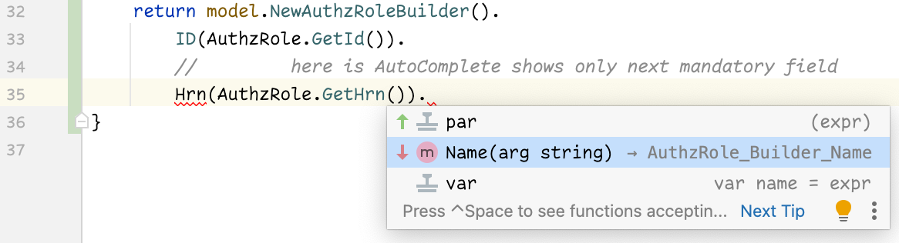
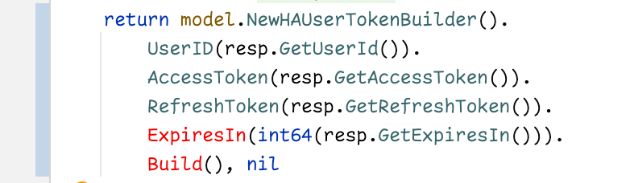

# GO Better - code generator for struct's mandatory fields

This project is an attempt to address lack of required fields in Go's struct types and to create
a construction that will actually enforce specifying mandatory fields by a compiler with the approach
similar to **named arguments**.

Here is how it is going to look like in IDE, you will see only the next mandatory field
that you have to set:



Here is an example when IDE (and Go compiler) shows you that you have missing mandatory
field (between `ExpiresIn` and `Build()`), and you will not be able to compile code until
you have this error fixed):



Looks great, right? Let's see how to achieve this. As you are aware, when you create a
structure in Go - you cannot specify required fields. For example, if we have a structure
for Person such as:

```
type Person struct {
	FirstName   string
	LastName    string
	Age         int
	Description string // optional field
}
```

then normally this is how you create the instance of this structure:

```
var person = Person{
    FirsName: "Joe",
    LastName: "Doe",
    Age: 40,
}
```

This is all good unless you have a different places where you have to create a `Person` structure,
then when you add new fields, it will become a challenge to scan through code to find all occurrences
of creating Person. One of the suggestions you can find is to create a constructor function with
arguments representing required fields. In this case you can create and fill `Person` structure
with `NewPerson()` function. Here is an example:

```
func NewPerson(firstName string, lastName string, age int) *Person {
    return &Person{
        FirstName = firstName,
        LastName = lastName,
        Age = age,
    }
}
```

The typical call will be

```
person := NewPerson("Joe", "Doe", 40)
```

This is not a bad solution, but unfortunately it means that you have to manually update your `NewPerson`
function every time when you add or remove fields. Moreover, because Go does not have named parameters,
you need to be very careful when you move fields within the structure or add a new one, because you might
start passing wrong values.
E.g. if you swap FirstName and LastName in Person structure then suddenly your call to `NewPerson`
will be resulting in FirstName being "Doe" and LastName being "Joe". Compiler does not help us here.

**gobetter** addresses this issue by generating builder chain of functions and structs for you that
**enforces** the flow of builder setter functions and will allow calling `Build()` function only on the
last mandatory field. In this case compiler will raise an error if you missed a parameter or put it
in a different order.

### Pre-requisites

You have to install two tools:

First one is **goimports** (if you don't have it already installed). It will be used by **gobetter** to
optimize imports and perform proper formatting.

```shell
go get -u golang.org/x/tools/cmd/goimports
```

Then you must install **gobetter** itself:

```shell
go get -u github.com/mobiletoly/gobetter
```

## Usage

**gobetter** uses code generation approach to create constructors with named arguments. First you have
to add `go:generate` comment into a file with a structures you want to create required parameters for,
after that you can mark required fields with a  special comment. Let's take a look at the example:

```
package main

//go:generate gobetter -input $GOFILE

type Person struct { //+gob:Constructor
	firstName   string  //+gob:getter
	lastName    string  //+gob:getter
	dob         string  //gob:getter +gob:acronym
	Score       int     
	Description string  //+gob:_
}
```

- `+gob:Constructor` comment serves as a flag and must be on the same line as struct (you can add more
text to this comment but flag needs to be a separate word). It instructs gobetter to generate construction
function (`NewPersonBuilder()` in our case). Read below to find out why "Constructor" starts with
upper-case "C".


- `//+gob:getter` is to generate a getter for field, should be applied only for fields that start in
lowercase (non-exported fields). It will effectively make these fields read-only for callers outside a
package.


- `//+gob:_` flag in comment hints gobetter that structure field is optional and should not be added
to builder chain.


- `//+gob:acronym` specifies that field is acronym. In our case `dob` (date of birth) will remain private
field but since it has getter - then getter will be generated as `DOB()` function (instead of `Dob()`).
Named parameters will be named using all upper-cased characters as well.

All you have to do now is to run `go generate` tool to generate go files with builder chain for your class.

```shell
go generate ./...
```

Once file (usually with `_gob.go` suffix) will be created, you can build Person structure with a call:

```
person := NewPersonBuilder().
  FirstName("Toly").
  LastName("Somebody").
  DOB("01/01/1978").
  Age(99).
  Build()  // this will produce Person structure
// optional parameters
person.Description = "some description"
```

What is really important is that there is no way how you can remove any of the setters in builder flow
or put them in a different order. You can try just to see that it will result in compilation error. So
this builder flow really enforces in compile time that all your mandatory parameters will be set.

### Constructor options

Unless you specify otherwise with comnand-line flags - gobetter only processes structures marked
with `//+gob:` comment annotations, and you have few options to choose from:

- `//+gob:Constructor` - generate upper-cased exported constructor in form of **NewClassName**.
This flag is honored only if class itself is exported (started with uppercase character),
otherwise package-level lower-cased constructor **newClassName** will be generated


- `//+gob:constructor` - generate package-level constructor in form of **newClassName** even for
exported classes


- `//+gob:_` - no builder setter is generated for this field. This is useful to mark optional fields
in your structure


### Integration with IntelliJ

It can be annoying to run `go generate ./...` from a terminal every time. Moreover, call this command will be generating
required fields support for all your files every time, while most of the time you want to do it on per-file basis. The
easiest approach for IntelliJ is to set up a FileWatcher for .go files and run generate command every time you change a
file. Depending on your OS - instructions can be slightly different but in overall they remain the same. For Mac OS in
your IntelliJ select from main menu **IntelliJ IDEA / Preferences / Tools / File Watcher** and add
<custom> task. Name it `Go Generate files` and setup **Files type**: `Go files`, **Program**: `go`,
**Arguments**: `generate`.<br>
At this point it should work, but File Watcher will be monitoring your entire project directory and not only your own
files, but also generated _gob.go files as well. It means that gob files will be constantly re-generated, and it might
annoy you with a little status bar progress constantly flashing. We want to exclude generated gob files from being
watched by selecting **Scope** text field of **File Watcher** dialog. Click `...` button on the right of the **Scope**
text field, in new window create new **Local** scope, name it (e.g. `Go project files`) and add
`file:*.go&&!file:*_gob.go` to **Pattern** text field.

This will do it. Now when you save Go file - `go generate` will be automatically run for your file.

### Gobetter generator customization

**gobetter** generator has few switches allowing you a better control of generated output.

`-input <input-file-name>` - input file name where to read structures from

`-output <output-file-name>` - optional file name to save generated data into. if this switch is not
specified then gobetter will create a filename with suffix `_gob.go` in the same directory where the input file resides.

`-generate-for all|exported|annotated` - sometimes you don't want to annotate structures with *//+gob:*
constructor annotation, or you don't have this option, because files with a structures could be
auto-generated for you by some other tool. In this case you can invoke gobetter from some other file
and pass **-generate-for** flag to specify that you want to process structures that don't have annotation
comments. **all** value will process all exported and package-level structs while**exported** will
process only exported (started with uppercase character) structures. **annotated** value disables
automatic processing of structures (this is default behavior) and requires structure annotation comments.

`-constructor exported|package|none` - this flag makes sense only for structures processed by
**-generate-for** flag. **exported** value enforces creation of exported struct constructors (for
package-level structures package-level constructors will be generated). **package** value enforces
creation of package-level constructors for all structures. **none** means no constructors will be
provided (but gobetter will process structure in order to generate getters if necessary).

Example:

```
package main

//go:generate gobetter -input=./internal/graph/model/models_gen.go -generate-for=exported -receiver=pointer -constructor=package

import (
    ...
)
```
